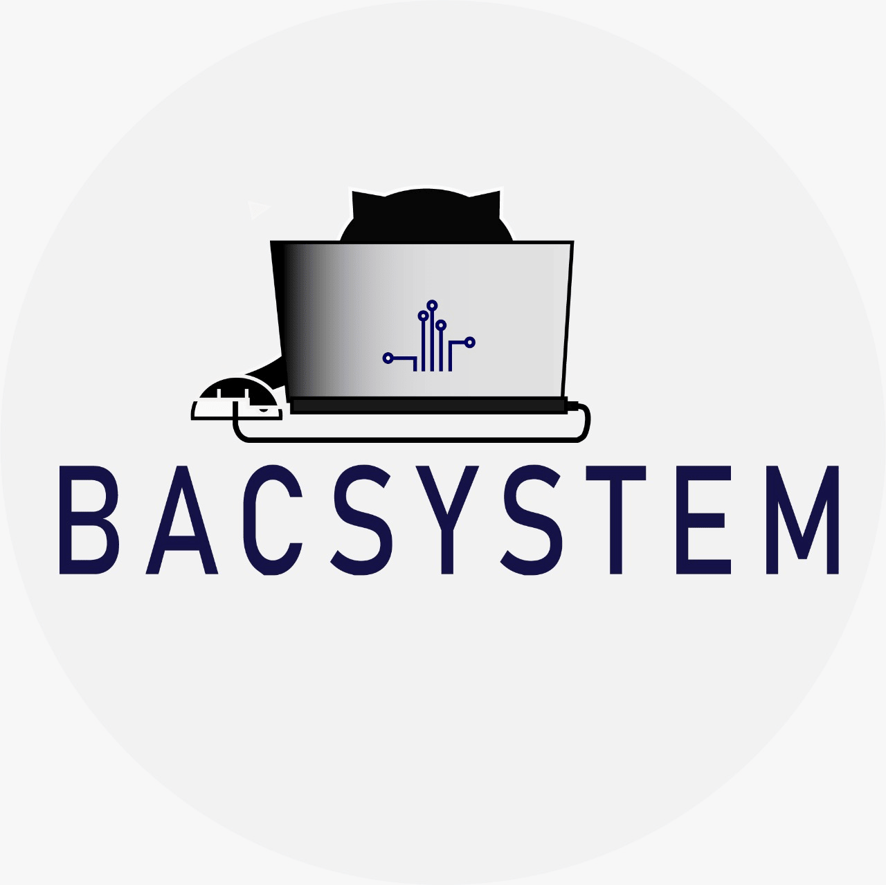

<p align="center">
    <a >
        
    </a>
    <a href="https://angular.io/cli" target="blank">
        
    </a>
</p>

<div align="center">
  <a href="https://github.com/dbacilio88/node-angular/graphs/contributors" alt="Contributors">
    
  </a>
  
  <a href="https://github.com/dbacilio88/node-angular/blob/master/LICENSE" alt="GitHub Licence">
    
  </a>
  <a href="https://discord.gg/HjJCwm5">
    
  </a>


</div>

# NodeAngular

This project was generated with [Angular CLI](https://github.com/angular/angular-cli) version 16.2.0.

## Development server

Run `yarn start` for a dev server. Navigate to `http://localhost:4200/`. The application will automatically reload if you change any of the source files.

```bash
$ yarn start
```

## Code scaffolding

Run `ng generate component component-name` to generate a new component. You can also use `ng generate directive|pipe|service|class|guard|interface|enum|module`.

```bash
$ ng generate component component-name
```

## Build

Run `yarn build` to build the project. The build artifacts will be stored in the `dist/` directory.

```bash
$ yarn build
```

## Running unit tests

Run `yarn test` to execute the unit tests via [Karma](https://karma-runner.github.io).

```bash
$ yarn test
```

## Running docker image

```
$ docker build -t node-angular . --no-cache
$ docker container run -p 80:80 node-angular
```


